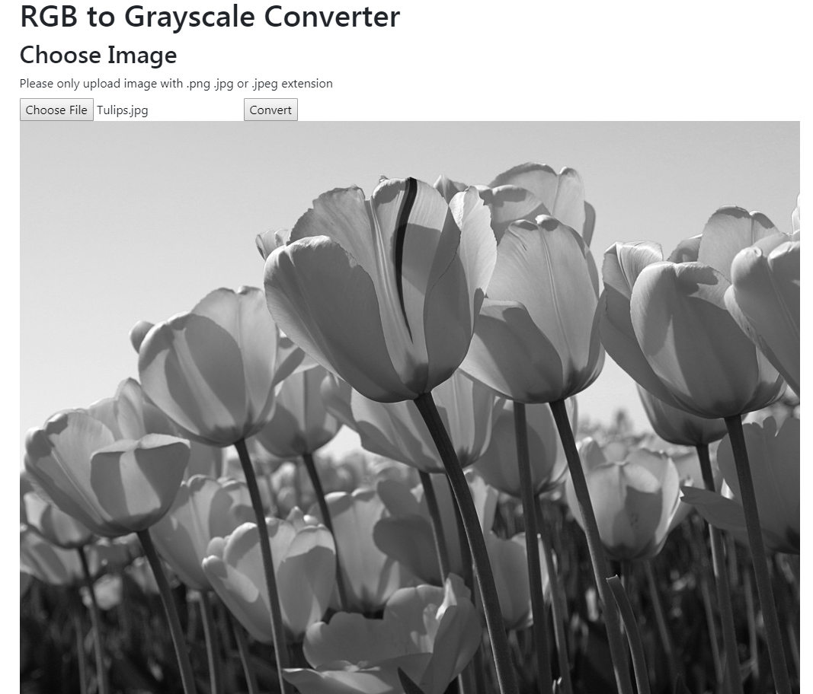

# RGB to Grayscale Converter

## Installation

Clone this repo

```
git clone https://github.com/albertsundjaja/convert_image_api.git
```

Ensure that you have a working installation of `Anaconda`, otherwise you would need to install the dependency on your own (using pip or other methods)

Go to the `convert_image_api` folder

Create a new environment
```
conda env create -f converter_api.yml
```

Activate the new environment

```
conda activate converter_api
```

set the flask app
```
# for windows
set FLASK_APP=main.py
# for mac/linus
export FLASK_APP=main.py
```

run the flask app

```
python -m flask run --port=5000
```

Open your browser (Chrome/Firefox preferred), and go to http://localhost:5000

## Demo



Choose an image file to be converted into grayscale, then click `Convert` button

The converted image will be displayed just like the demo above

## FEND source

the source code for the React frontend is available in the folder `react_fend`